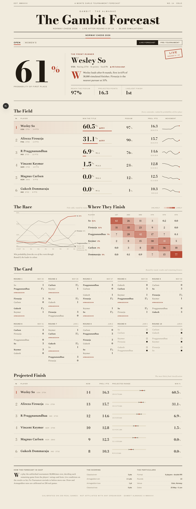

# The Gambit Forecast

A Monte Carlo tournament almanac: live and pre-tournament championship odds for **Norway Chess 2026** (Open and Women's), modelling Norway Chess's distinctive **Armageddon scoring**, and **calibrated against 258 real games**.

[](https://github.com/SatvikBajpai/norwaychess-2026/actions/workflows/ci.yml)
[](./LICENSE)


### ▶ Live: [norwaychess-2026.vercel.app](https://norwaychess-2026.vercel.app)

[](https://vercel.com/new/clone?repository-url=https%3A%2F%2Fgithub.com%2FSatvikBajpai%2Fnorwaychess-2026)



## What it is

An editorial "almanac" that plays the rest of the tournament out tens of thousands of times and reports, per player: probability of winning the title, podium odds, the round-by-round title-odds **Race**, a finishing-position heatmap, the round-by-round **results card**, and a **projected final table**. Two modes:

- **Live forecast** - conditioned on the games already played (through Round 8).
- **Pre-tournament** - simulated from ratings, ignoring results so far.

Both the **Open** and **Women's** events, via a toggle. The whole sheet is config-driven, so a new tournament is just a config entry.

## Why Norway Chess is different to model

Most tournament sims treat a game as win / draw / loss worth 1 / ½ / 0. Norway Chess doesn't allow a quiet draw:

| Outcome | Points |
| --- | --- |
| Classical win | **3** (loser 0) |
| Classical draw → Armageddon win | **1.5** |
| Classical draw → Armageddon loss | **1** |

So every game is a two-stage outcome tree (classical result, then a conditional Armageddon), and the round-by-round **Race** chart is a genuine trajectory: for each round we re-simulate conditioned on the results so far. (In this event, Carlsen opens as the 51% pre-tournament favourite and falls to 0% as his tournament unravels, while So surges to 61%.)

## Calibrated, not hand-waved

The game model is backtested against **258 real Norway Chess games** (2022-2026, both sections), each validated by reconstructing its official final standings. The backtest found the original model badly under-predicted draws (39% vs 63% observed) and recalibrated it; classical Brier improved 0.606 → 0.520 and the win-probability reliability curve is now nearly diagonal. Full write-ups:

- [**METHODOLOGY.md**](./METHODOLOGY.md) - the whole pipeline
- [**CALIBRATION.md**](./CALIBRATION.md) - the empirical backtest, findings, before/after, limitations

## Inspiration

Inspired by [**XanthH/candidates_simulation**](https://github.com/XanthH/candidates_simulation), a Python Monte Carlo of the FIDE Candidates 2026. The Gambit Forecast adapts the same per-event-form Monte Carlo idea to Norway Chess's Armageddon scoring, adds live conditioning and a calibration backtest, and presents it as an interactive almanac.

## Tech

- Next.js 16 (App Router) + React 19 + TypeScript
- Pure-TypeScript simulation engine (`lib/sim.ts`), run client-side in non-blocking chunks
- Deployed on Vercel as a static-friendly app (the simulation runs in the browser, so there is no server compute cost)

## Run locally

```bash
npm install
npm run dev          # http://localhost:3000
```

```bash
npm run backtest     # calibration report (npx tsx scripts/backtest.ts)
npm run analyze      # per-edition rates + structural data checks
npm run build        # production build (includes type-check)
```

## Project layout

| Path | What |
| --- | --- |
| `lib/sim.ts` | Monte Carlo engine, scoring, the game model |
| `lib/forecast.ts` | live + pre view-model and the round-by-round trajectory |
| `lib/data.ts` | field, ratings, schedule and results through Round 8 |
| `lib/tournaments.ts` | config-driven tournament/event meta |
| `lib/backtest.ts` | scoring rules, reliability, baselines, parameter fit |
| `data/history.ts` | 210 validated past-edition games (calibration data) |
| `app/page.tsx` | the almanac UI |

## Keeping it current

Norway Chess 2026 runs to 5 June. As each round is played, fill in the `result` for the relevant pairings in `lib/data.ts` and the live forecast updates itself.

## License

[MIT](./LICENSE) © 2026 Satvik Bajpai. Not affiliated with any tournament organiser; player results and ratings are public factual data.
